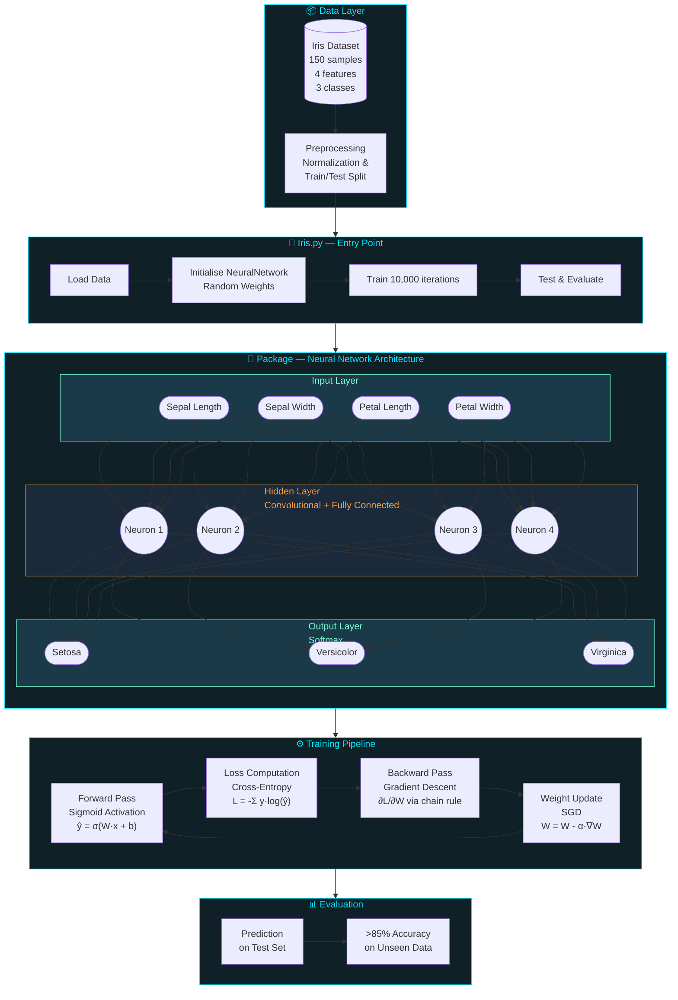

# Neuro-Net
This project is all about Deep Learning and Neural Network

Here I have developed an Convolutional Neural Network using Object Oriented Programming.
Cost function used : Sigmoid.
Gradient Descent : Stochastic Gradient Descend.

This is tested using Iris Dataset and it is giving a prediction performance of more than 85% on previously unseen data..

